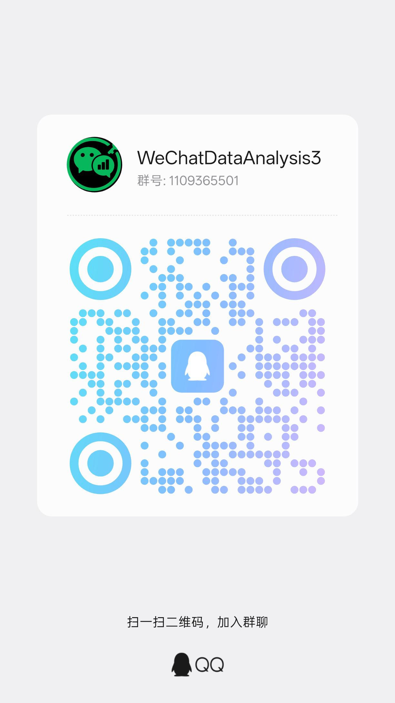

<p align="center">
    
</p>

<div align="center">
    <h1>WeChatDataAnalysis - 微信数据库解密与分析工具</h1>
    <p>微信4.x数据解密并生成年度总结，高仿微信，支持实时更新，导出聊天记录，朋友圈等大量便捷功能</p>
    官网链接：https://lifearchiveproject.github.io/WeChatDataAnalysis/<p>如需定制功能，请联系 QQ：3434549571。</p>
    
    
    
    
    <a href="https://qm.qq.com/q/2IB0gvYpYA"></a>
    
    
    
    <p>如果你需要 QQ 侧的数据解密、分析或年度总结类工具，欢迎体验 <a href="https://github.com/H3CoF6/WeQ">H3CoF6/WeQ</a>；WeQ 作者也是本项目开发成员之一</p>
</div>

## 年度总结

<table>
  <tr>
    <td align="center" colspan="2"></td>
  </tr>
  <tr>
    <td></td>
    <td></td>
  </tr>
  <tr>
    <td></td>
    <td></td>
  </tr>
  <tr>
    <td></td>
    <td></td>
  </tr>
  <tr>
    <td></td>
    <td></td>
  </tr>
</table>

## 界面预览

<table>
  <tr>
    <td align="center" colspan="2"><b>聊天记录页面</b>（支持多种消息类型展示，样式尽可能与微信保持一致）</td>
  </tr>
  <tr>
    <td colspan="2" align="center"></td>
  </tr>
  <tr>
    <td align="center" colspan="2"><b>修改消息</b>（本地修改，支持恢复）</td>
  </tr>
  <tr>
    <td colspan="2" align="center"></td>
  </tr>
  <tr>
    <td align="center" colspan="2"><b>实时消息同步</b>（点击侧边栏闪电图标后，消息会自动刷新）</td>
  </tr>
  <tr>
    <td colspan="2" align="center"></td>
  </tr>
  <tr>
    <td align="center" colspan="2"><b>设置面板</b>（桌面行为、启动偏好、更新、朋友圈缓存策略）</td>
  </tr>
  <tr>
    <td colspan="2" align="center"></td>
  </tr>
  <tr>
    <td align="center" colspan="2"><b>朋友圈</b>（支持查看用户之前朋友圈的背景图及时间；本地查看过的朋友圈即使后续不可见也可以查看）</td>
  </tr>
  <tr>
    <td colspan="2" align="center"></td>
  </tr>
  <tr>
    <td align="center" colspan="2"><b>聊天记录搜索</b></td>
  </tr>
  <tr>
    <td colspan="2" align="center"></td>
  </tr>
  <tr>
    <td align="center" colspan="2"><b>聊天记录导出</b></td>
  </tr>
  <tr>
    <td colspan="2" align="center"></td>
  </tr>
  <tr>
    <td align="center" colspan="2"><b>联系人导出</b></td>
  </tr>
  <tr>
    <td colspan="2" align="center"></td>
  </tr>
</table>

## 高级版

常规版聚焦于**解密、读取、导出与年度总结**等只读能力；**高级版**在此基础上提供 **61 项写入、动作与自动化能力**，覆盖消息修改、消息补录、微信动作、朋友圈同步与互动、群聊与联系人管理，以及自动化任务。当前公开版本仅展示功能说明与演示动画，不包含高级功能的执行实现；实际使用需要匹配微信版本的高级版。

> **获取方式**：请联系 QQ **3434549571**（备注「高级版」）即可获取。

| 模块 | 高级版功能 |
| --- | --- |
| 消息修改 | 修改文字消息、编辑消息源码、修改时间、字段编辑、恢复原消息、修复为我发送、反转微信气泡位置、删除系统消息 |
| 消息补录 | 文字、图片、文件、语音、视频、表情、转账记录、红包记录、位置、链接卡片、小程序卡片、视频号卡片、引用消息、合并聊天记录、通话记录、系统消息、拍一拍记录 |
| 微信动作 | 发送文字消息、发送群聊真 @、发送图片、视频、表情、语音（支持 MP3）、文件、链接卡片、拍一拍，以及单会话标记已读、会话免打扰 |
| 朋友圈 | 连续同步动态及历史页、朋友圈点赞、图片评论、文字评论、发布朋友圈 |
| 群聊 | 修改本人群昵称、发布群公告、新建群聊、修改群名称、拉好友进群、邀请成员进群、移除群成员、退出群聊、群成员批量加好友 |
| 联系人 | 修改好友备注、同意好友请求、添加好友、删除好友、新建标签、设置标签、手机号 / 微信号找人、联系人变化记录 |
| 自动化任务 | 定时群发任务、新好友备注 / 标签 / 欢迎消息处理、朋友圈跟圈任务（按关键词筛出新动态，自动点赞、评论并跟发同样内容，命中屏蔽词的不发） |

其中**消息修改、消息补录以及会话标记已读、会话免打扰共 27 项直接回写你本机的微信还可同步到手机**，改动均可随时一键还原

## 可导出的内容

| 内容 | 支持格式 | 导出范围 / 说明 |
| --- | --- | --- |
| 聊天记录 | HTML / JSON / TXT / Excel（ZIP） | 当前会话、自定义会话、全部会话、群聊或单聊；支持按消息类型和时间筛选 |
| 朋友圈 | HTML / JSON / TXT / Excel（ZIP） | 指定联系人或全部联系人 |
| 联系人 | HTML / JSON / TXT / Excel | 支持按联系人分类和关键词筛选，可选择是否包含头像链接 |
| 收藏 | HTML / JSON / TXT / Excel（ZIP） | 支持按收藏类型和关键词筛选 |
| 好友验证 | HTML / JSON / TXT / Excel | 支持按发起方向和关键词筛选 |
| 小程序 | HTML / JSON / TXT / Excel | 支持按关键词筛选 |
| 视频号直播 | HTML / JSON / TXT / Excel | 支持按直播类型和关键词筛选 |
| 转账与红包 | HTML / JSON / TXT / Excel | 支持按记录类型和关键词筛选 |
| 服务号记录 | HTML / JSON / TXT / Excel | 支持按服务号和记录类型导出 |
| 账号数据归档 | ZIP | 可选择导出数据库、资源文件或两者 |

> Excel 格式生成 `.xlsx` 文件；聊天记录、朋友圈和收藏会将对应格式文件与必要资源一起打包为 ZIP。

## 加入群聊

也欢迎加入下方 QQ 群一起讨论。

<p align="center">
    <a href="https://qm.qq.com/q/2IB0gvYpYA">
        
    </a>
</p>

## 快速开始

### 1. 下载桌面安装包（推荐）

1. 打开 Release 页面（最新版）：https://github.com/LifeArchiveProject/WeChatDataAnalysis/releases/latest
2. Windows 下载 `Setup.exe`；macOS 15+ 的 Apple Silicon Mac 下载 `.dmg` 或 `mac.zip`
3. 安装完成后启动 `WeChatDataAnalysis`

>
> macOS 首次打开若提示来源限制，请在“系统设置 → 隐私与安全性”中确认来自本仓库的应用。图片密钥扫描还可能需要授予终端或应用辅助功能权限。

### 2. 从源码运行（开发者/高级用户）

#### 2.1 克隆项目

```bash
git clone https://github.com/LifeArchiveProject/WeChatDataAnalysis.git
cd WeChatDataAnalysis
```

#### 2.2 安装后端依赖

```bash
# 使用uv (推荐)
uv sync --no-editable
```

#### 2.3 安装 WCDB 隔离运行时

实时聊天读取需要 Electron 隔离进程。全新克隆或 `desktop/package-lock.json` 更新后必须同步桌面端依赖：

```bash
cd desktop
npm ci
cd ..
```

#### 2.4 安装前端依赖

```bash
cd frontend
npm ci
```

#### 2.5 启动服务

Windows x64 与 Apple Silicon macOS 都应直接启动完整桌面开发模式：

```bash
cd desktop
npm run dev
```

#### 启动后端API服务
```bash
# 在项目根目录
uv run --no-sync main.py
```

`main.py` 会在任何项目包导入前优先加入当前仓库的 `src`，并在启动日志中打印 `wechat_decrypt_tool` 的代码来源。开发运行时应指向当前仓库的 `src/wechat_decrypt_tool/__init__.py`，而不是 `.venv/Lib/site-packages` 中的旧副本。Windows 中文路径下不要改用 editable 安装；Python 3.11 可能按系统代码页读取 uv 生成的 UTF-8 `.pth`，导致解释器启动失败。

#### 启动前端开发服务器
```bash
# 在frontend目录
cd frontend
npm run dev
```

#### 2.6 访问应用

- 前端界面: http://localhost:3000
- API服务(默认): http://localhost:10392 （可通过环境变量 WECHAT_TOOL_PORT 修改）
- API文档(默认): http://localhost:10392/docs

## 聊天 AI 总结与关注提醒

在「设置 → AI 服务」配置模型后，点击聊天右上角 AI，可按条数或时间批量总结群聊与好友消息，并设置定时总结、消息阈值和 AI 语义关注提醒。支持图片、常见文档分析及桌面通知。详见 [使用与开发说明](docs/chat-ai.md)。

可在「设置 → AI 服务 → 本地检索」按账号开启可选的语义检索，使用 Hugging Face 固定版本模型，支持 CPU 与 NVIDIA GPU 自动回退。使用方法、下载来源和兼容性实测见 [本地语义检索说明](docs/local-semantic-search.md)。

## MCP 服务

设置页中的“AI 接入提示词”会包含 endpoint 和 Bearer token，可直接复制给客户端作为接入指令。

## 打包为 EXE（Windows 桌面端）

本项目提供基于 Electron 的桌面端安装包（NSIS `Setup.exe`）。

```bash
# 1) 安装桌面端依赖
cd desktop
npm ci

# 2) 打包（会自动：nuxt generate -> 拷贝静态资源 -> PyInstaller 打包后端 -> electron-builder 生成安装包）
npm run dist
```

输出位置：`desktop/dist/WeChatDataAnalysis Setup <version>.exe`

## 打包为 DMG / ZIP（macOS 桌面端）

本项目提供基于 Electron 的 macOS ARM64 桌面端安装包。

```bash
# 1) 安装桌面端依赖
cd desktop
npm ci

# 2) 打包（会自动：nuxt generate -> 拷贝静态资源 -> PyInstaller 打包后端 -> electron-builder 生成安装包）
npm run dist:mac
```

输出位置：`desktop/dist/WeChatDataAnalysis-<version>-mac-arm64.dmg` 和 `desktop/dist/WeChatDataAnalysis-<version>-mac-arm64.zip`

## 安全说明

**重要提醒**:

1. **仅限个人使用**: 此工具仅用于解密您自己的微信数据
2. **密钥安全**: 请妥善保管您的解密密钥，不要泄露给他人
3. **数据隐私**: 解密后的数据包含个人隐私信息，请谨慎处理
4. **合法使用**: 请遵守相关法律法规，不得用于非法目的

## 免责声明

请在充分理解以下内容，并自愿承担相应责任的前提下使用本项目：

1. **项目性质**

   本项目为独立开发的非官方开源工具，与微信、腾讯及其关联主体不存在隶属、授权、合作或认可关系。相关产品名称和商标归其权利人所有。

2. **合法使用**

   本项目仅可用于处理使用者本人合法持有、管理或已经取得明确授权访问的数据。使用者应遵守适用的法律法规、软件许可协议、平台规则和隐私保护义务。

3. **数据与备份**

   使用过程可能涉及本地数据库、密钥、聊天记录、媒体文件、微信进程和系统接口。开始前请备份重要数据、密钥及配置，并自行负责密钥保管、数据安全和隐私保护。

4. **兼容性与运行风险**

   客户端版本变化、内存扫描、Hook、第三方组件及其他本地处理流程，可能导致账号提醒、功能失效、处理失败、文件异常或其他不可预期结果。本项目不保证对未来微信版本持续兼容。

5. **责任范围**

   本项目按现状提供，不对功能的准确性、完整性、稳定性或持续可用性作出明示或默示保证。在适用法律允许的范围内，因使用、误用、版本不兼容、操作中断或第三方策略变化产生的损失和后果，由使用者自行承担。

使用或继续使用本项目，即表示使用者已经阅读、理解并同意以上内容，并愿意对自己的操作及其结果负责。

## 致谢

1. **[H3CoF6](https://github.com/H3CoF6)**
2. **[echotrace](https://github.com/ycccccccy/echotrace)**
3. **[WeFlow](https://github.com/hicccc77/WeFlow)**
4. **[wx_key](https://github.com/ycccccccy/wx_key)**
5. **[wechat-dump-rs](https://github.com/0xlane/wechat-dump-rs)**
6. **[oh-my-wechat](https://github.com/chclt/oh-my-wechat)**
7. **[vue3-wechat-tool](https://github.com/Ele-Cat/vue3-wechat-tool)**
8. **[wx-dat](https://github.com/waaaaashi/wx-dat)**
9. **[Ritsu](https://xhslink.com/m/7YJUsd1sgyF)**
10. **[recarto404](https://github.com/recarto404)**
11. **[xiaoshengbao](https://github.com/xiaoshengbao)**

## 贡献

欢迎提交Issue和Pull Request来改进这个项目。
