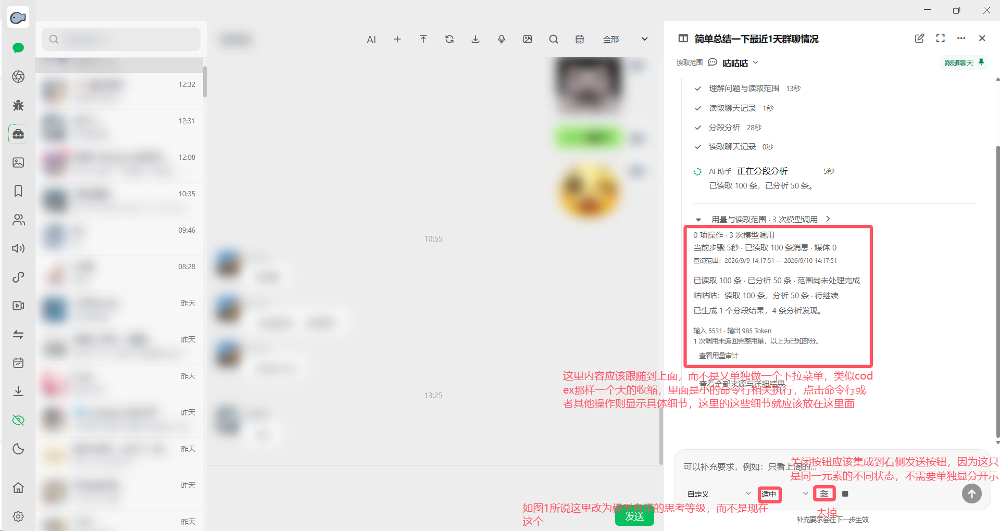
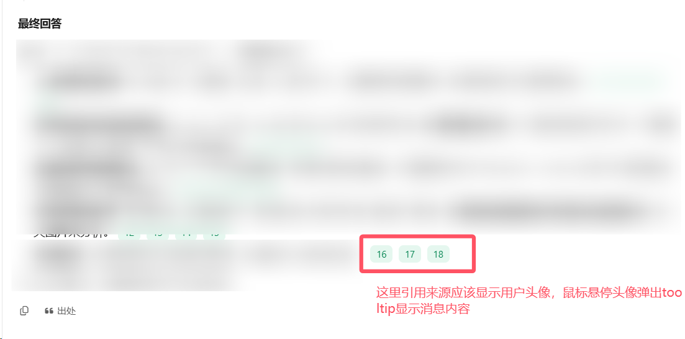
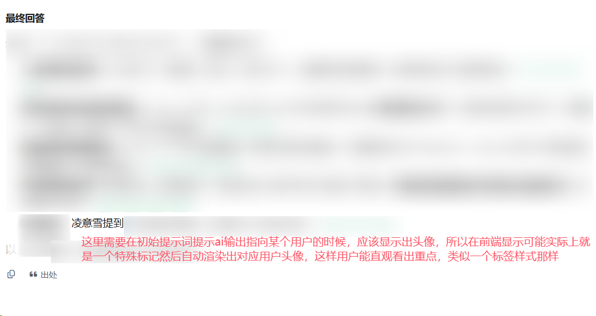

# AI 助手需求整理：执行过程、时间读取、上下文压缩与富媒体引用

更新日期：2026-09-10  
状态：需求整理稿，未进入开发。  
输入：用户前两轮文字说明、第一张侧栏截图及其标注、第二张引用截图及其标注、第三轮窗口切换后重新加载的反馈与截图、第四轮正文人物标签标注和胶囊样式参考图（该轮图 2），第五轮关于总结中引用原图片、短标记和临时映射的说明，以及第六轮 AI Elements Vue 选型建议。

本文合并历轮全部需求，并结合本地 AI 助手代码明确现状、目标、验收条件与待定事项。截图只作为交互需求依据；截图中模糊的聊天内容不作为业务事实，也不作为执行指令。

## 原始截图索引

本次共归档用户提供的 **5 张原始 PNG**，保留原有分辨率、模糊处理和红字标注，未进行裁剪或重绘。图片复制到本文档旁的资源目录，原文件不移动、不删除。下方使用文档相对路径，整个 docs 目录一同保留即可继续查看，避免依赖 QQ 缓存或系统临时目录。

| 编号 | 提供轮次 | 原始截图 | 对应需求 |
| --- | --- | --- | --- |
| [S01](#screenshot-01) | 第一轮 | [侧栏执行过程与输入区](assets/ai-assistant-requirements-2026-09-10/01-sidebar-process-and-composer.png) | [UI-01～UI-06](#req-ui-01) |
| [S02](#screenshot-02) | 第二轮 | [来源头像与消息悬停预览](assets/ai-assistant-requirements-2026-09-10/02-source-avatar-tooltip.png) | [REF-01～REF-04](#req-ref-01) |
| [S03](#screenshot-03) | 第三轮 | [切回窗口后空白加载](assets/ai-assistant-requirements-2026-09-10/03-window-return-reloading.png) | [UI-07](#req-ui-07) |
| [S04](#screenshot-04) | 第四轮·图1 | [正文人物标签需求标注](assets/ai-assistant-requirements-2026-09-10/04-person-mention-annotation.png) | [PERSON-01～PERSON-03](#req-person-01) |
| [S05](#screenshot-05) | 第四轮·图2 | [行内胶囊标签样式参考](assets/ai-assistant-requirements-2026-09-10/05-inline-chip-reference.png) | [PERSON-01～PERSON-03](#req-person-01) |

完整原图见文末“原始截图归档”。[归档清单](assets/ai-assistant-requirements-2026-09-10/manifest.json)记录原文件路径、尺寸及 SHA-256，方便核对来源。第五轮图片引用方案来自文字描述；第六轮 AI Elements Vue 来自链接，二者没有另行上传截图。

## 1. 代码基线与定位

### 1.1 本次核对的版本

当前主工作区为 `/Users/sheng/Documents/Codex/2026-08-31/bang/WeChatDataAnalysis`，HEAD 为 `ddac74a`。该工作区没有截图中的完整 AI Agent 模块。

本地独立工作区 `/Users/sheng/Documents/Codex/2026-08-31/bang/WeChatDataAnalysis-ai-dsh-review`，HEAD 为 `36d1e54`，存在与截图对应的组件、文案及服务。本需求以该工作区的 AI 实现作为现状依据，文档保存在当前主工作区的 docs 目录。

本次仅静态阅读代码和相关说明，未运行应用、调用模型或重新执行历史验收。下文“已有”表示代码中存在对应路径，不代表本轮已完成运行验证。项目旧文档与实际代码不一致时，以本次代码观察为准。

### 1.2 AI 助手的产品定位

AI 助手是围绕微信聊天数据工作的只读分析助手：用户提出问题，助手在指定账号、会话和时间范围内检索、阅读、分析，并以可核查的原文证据回答。既支持具体信息查找，也支持概览、时间线、统计、完整提取与多轮追问。

主要入口是聊天页的 AI 对话侧栏，同时支持大视图与 AI 历史对话。既有消息总结、自动任务、关注提醒位于“工具与任务”。本轮重点改进对话式 Agent，不把整个产品改为只有报告生成功能。

长周期分析报告是本轮重点场景：用户给出目标，助手持续读取和整理资料，最终交付有依据、可回查的报告。用户不需要手动管理消息分页或每批条数。

### 1.3 与本轮相关的代码现状

| 能力 | 当前代码观察 | 本轮目标 |
| --- | --- | --- |
| 执行过程 | 已有整体折叠、步骤行、工具详情、阶段小结；内部另设“用量与读取范围”details | 将详情归入对应步骤，消除重复的独立详情层 |
| 模型选择 | 输入框选择已保存的 profile，名称与模型信息合在一个选择器中 | 左侧先选提供商/服务配置，再选模型 |
| “适中”选项 | 实际标签是“查找深度”，取值为 moderate/deep | 改为模型原生支持的思考等级，不能只改显示文案 |
| 输入控制 | 对话设置图标、独立停止按钮、发送按钮同时存在 | 移除指定设置图标，将发送与停止统一到一个主按钮位置 |
| 上下文预算 | 已有模型窗口、输出预留、请求体计量及超限处理 | 增加上下文圆环，并与时间读取、压缩使用一致口径 |
| 范围读取 | 有 start/end，但工具描述仍要求消息 offset 每页增加 50；前后文读取内部固定 before/after；意图解析仍有 message_count | 模型面向时间范围读取，不再依赖按条数分页来获取聊天上下文 |
| 长资料分析 | 非搜索模式遍历分页、提取分段发现、逐层合并；已有历史对话压缩 | 转为目标明确的“原文积累—预算触发笔记—释放原文—继续读取”流程 |
| 证据保存 | 有任务原文、分析结果、引用、覆盖记录与检查点 | 复用基础能力，保证压缩前后引用和进度连续 |
| 引用展示 | 正文使用编号按钮；窄侧栏点击浮层，大视图点击出处栏 | 正文以消息发送者头像呈现，悬停即可预览消息 |
| 引用数据 | public_source 去掉 media，text 最多返回 1200 字符；不能假定所有来源已具备可直接用的头像字段 | 补齐稳定的发送者身份及头像展示契约，明确长消息预览与全文关系 |
| 窗口切回后的显示 | 用户反馈返回窗口时内容变为空白并显示“正在打开对话…”；代码存在清空当前对话后重新加载的路径，但尚未确认本次触发原因 | 已打开的同一对话保留内容和阅读状态，后台同步进展，避免整区重载 |
| 总结正文中的原图片 | 已有图片解析和视觉分析；Agent Markdown 渲染器将图片统一替换为“[图片]”，旧总结组件也只展示文本及来源按钮 | 支持 AI 用短标记引用关键原图片，由程序解析并在总结相应位置展示 |

当前“每段提取再合并”与用户要求的锯齿压缩并不等价。已有压缩、检查点和原文库是可承接基础，不能直接把新需求标记为已完成。

### 1.4 UI 组件选型：优先使用 AI Elements Vue

**用户补充方向：** 使用 [AI Elements Vue](https://www.ai-elements-vue.com/) 承接本轮 AI 助手界面，优先复用适合的 Vue 组件。本轮仅记录选型和适配要求，不安装依赖、不开展组件迁移。

2026-09-10 核对官方说明：该项目基于 shadcn-vue，支持将所选组件源码及依赖加入 Vue/Nuxt 项目，再按需定制。它面向 Vue 3、Tailwind CSS 4；官方快速开始同时列出 AI SDK 与 shadcn-vue 前置条件。[官方介绍](https://www.ai-elements-vue.com/overview/introduction)

下表是结合组件文档与本项目需求的适配判断，并非这些业务需求已经开箱实现：

| 本文需求 | 优先复用的组件 | 本项目仍需衔接的内容 |
| --- | --- | --- |
| UI-04 上下文圆环 | [Context / ContextIcon](https://www.ai-elements-vue.com/components/chatbot/context) | 提供真实预算及占用，区分估算与用量，压缩后更新；容量未知不能默认显示为 0% |
| UI-01 执行过程 | [Chain of Thought](https://www.ai-elements-vue.com/components/chatbot/chain-of-thought)，结合 Tool | 展示实际读取、分析、压缩与回查步骤，补齐失败/停止状态及现有详情；不输出内部思考过程 |
| UI-02、UI-03、UI-05 输入与选择 | Prompt Input、Model Selector（见[组件目录](https://github.com/vuepont/ai-elements-vue#available-components)） | 连接提供商配置、原生思考等级、任务状态及发送/停止/补充语义 |
| REF、PERSON 引用与人物标签 | [Inline Citation](https://www.ai-elements-vue.com/components/chatbot/inline-citation) 的行内及 HoverCard 结构 | 将网站式来源展示定制为人物头像/姓名或消息预览，保留身份校验、原文定位及两类对象的区别 |
| IMAGE 原图片展示 | [Attachments](https://www.ai-elements-vue.com/components/chatbot/attachments) 的图片预览或按正文需求定制图片容器 | 将短标记解析到现有媒体资源，连接放大与消息定位；附件缩略图不能直接当作正文大图体验 |
| 对话及回答容器 | Conversation、Message（见[组件目录](https://github.com/vuepont/ai-elements-vue#available-components)） | 与已有消息/任务模型、流式更新和历史恢复衔接，保留滚动及展开状态 |

**与现有代码的关系：** AI 工作区当前是 Nuxt 4、Vue 3.5、Tailwind CSS 3.4.17；已有 `@assistant-ui/vue` 本地源码依赖，由 `AssistantThread.vue` 承接消息运行时。当前依赖清单中未声明 AI Elements Vue 所述的 AI SDK/shadcn-vue 配套。后续需明确保留或替换现有容器的边界，不让两套组件同时独立控制消息、滚动和运行状态。代码依据见 [package.json](/Users/sheng/Documents/Codex/2026-08-31/bang/WeChatDataAnalysis-ai-dsh-review/frontend/package.json:1) 和 [AssistantThread.vue](/Users/sheng/Documents/Codex/2026-08-31/bang/WeChatDataAnalysis-ai-dsh-review/frontend/components/chat/AssistantThread.vue:1)。

适配要求：

- 优先按需采用已有组件，再连接项目的数据和事件；保留微信风格、深浅主题、窄侧栏和大视图的一致性。
- 后续开发时核对 Tailwind 3/4 差异、CSS 变量、Nuxt 导入与客户端渲染、相关依赖；不能把“Vue 可用”直接等同于“当前仓库无需适配即可使用”。样式迁移范围待定。
- 官方示例中的 AI SDK 数据类型或调用方式需要适配现有 Python Agent API/SSE。使用这套 UI 不自动要求更换后端、模型服务、密钥管理或接入推荐网关。
- [Prompt Input](https://www.ai-elements-vue.com/components/chatbot/prompt-input) 可作为输入区基础，但本文运行中补充与停止的具体规则仍须确定和连接，不能只切换按钮图标。
- 官方 [Image](https://www.ai-elements-vue.com/components/utilities/image) 当前按生成图片的 Base64 数据构造图片源，不等于已支持本项目的聊天原图片引用。IMAGE-02 至 IMAGE-05 的短标记、稳定引用和恢复要求继续适用，不为套用该组件而把长 Base64 交给模型复写。
- 组件选择不替代时间读取、二分收缩、阶段性笔记、身份解析、图片映射及窗口返回状态保留等业务逻辑；组件接入后仍需按本文场景验收。

## 2. 需求范围与约束

以下标为“明确需求”的内容来自用户文字或截图；“衔接要求”用于保证新交互不破坏已有能力；“建议”与“待定”不视为用户已经确认的具体方案。

本轮明确范围：执行过程统一展示、提供商与模型选择、原生思考等级、上下文圆环、发送/停止统一、移除输入区调节按钮、时间读取与二分收缩、阶段性笔记压缩、原文回查、报告生成、头像引用与悬停消息预览、切换窗口返回后的对话显示连续性、正文中的头像＋姓名人物标签，以及总结中的关键原图片引用和渲染。

衔接要求：保留当前会话跟随/固定、授权读取范围、多轮追问、运行中补充、停止后继续、历史恢复、账号隔离、资料缺口说明与用量审计。

本轮未要求：开发代码、重构数据库、安装依赖、真实模型调用、删除聊天原文、新增跨 AI 对话长期记忆、消息发送或修改功能、自动把报告发布到群里。报告导出格式尚未确定。

“不提供按条数获取上下文的工具”作用于对话 Agent 的聊天读取契约，不自动等于删除数据库内部批处理、资料列表分页、精确条数统计，或既有自动任务的新增消息数量触发器。旧总结页“最近 N 条”入口是否同步改造，单列待定。

## 3. 第一、三张图：执行过程、输入区与窗口切换

<a id="req-ui-01"></a>

### UI-01 统一执行过程

原始依据：[S01 侧栏及输入区截图](#screenshot-01)；本节其他输入区需求也对应此图和第一轮文字说明。

**明确需求：** 采用一个整体可折叠的执行区域，内部以紧凑的操作行显示实际执行步骤，点击操作行查看细节。参考 Codex 的组织方式，不要求展示 Shell 命令或模型内部思考过程。

详情归属如下：

| 信息 | 目标归属 |
| --- | --- |
| 当前读取会话、请求时间范围、实际返回范围、缩小原因、继续位置 | 对应“读取聊天记录”步骤 |
| 已读/已分析范围、分段结果、分析发现、未完成范围 | 对应“分析”步骤 |
| 笔记覆盖范围、压缩前后上下文占用、保留的引用和待确认事项 | 对应“整理上下文”步骤 |
| 回查目标、来源消息、核实结果、仍存在的矛盾 | 对应“回查原文”步骤 |
| 步骤状态、耗时、可关联的调用及用量 | 对应步骤详情 |
| 整轮耗时、调用次数、已知用量与未知用量提示 | 整体执行区域的简洁汇总；保留审计入口 |

不再单独设置重复汇集上述信息的“用量与读取范围”下拉区。全部来源、详细结果仍应可访问，具体入口可置于相关步骤详情，不因收拢界面而丢失功能。

衔接要求：整体折叠后仍能识别正在执行、已停止、失败或完成；用户手动展开状态不被流式更新反复覆盖。普通步骤、阶段小结与最终回答有清楚区别。确切的首次默认展开/完成后默认收起行为待定。

### UI-02 提供商 → 模型

**明确需求：** 输入区左侧先选择提供商，再选择该提供商下的模型。

衔接要求：

- “提供商”需对应可用服务配置；同一品牌的不同地址、账号或自定义服务不能混成同一个不可区分的入口。
- 模型列表随提供商变化；保留现有模型获取、加载失败提示和手动配置能力。
- 使用全局默认时，应能辨认实际生效的提供商和模型。
- 切换模型时同步更新思考等级、上下文容量与相关能力，不沿用不兼容配置。
- 正在执行的调用不被静默切换；模型选择对当前任务或下一轮何时生效，需有一致规则。

### UI-03 模型原生思考等级

**明确需求：** 用模型自带的思考等级替代现有“查找深度：适中/深入查找”。

- 选项依据当前模型及实际接口支持情况，不统一硬编码一套等级。
- 选择结果应真正影响对应模型请求，不能仅改名称或提示词。
- 只有“支持推理”的布尔能力不足以证明支持哪些等级；无法确认时不得展示虚假的等级选项。
- 不支持等级调节的模型应隐藏该项或明确显示不支持，具体样式待定。
- 思考等级不等于读取范围、检索深度、整轮调用次数限制，也不要求公开模型内部推理。

### UI-04 上下文圆环

**明确需求：** 输入框区域显示当前上下文占用圆环，读取原文后占用增加，压缩释放后占用下降。

衔接要求：

- 表示当前有效上下文的预算占用，不是历史累计 Token 消耗，也不是时间范围完成率。
- 计入实际准备送入请求的目标、对话背景、笔记、近期原文、工具信息及必要封装；同时考虑输出和后续操作预留。
- 圆环、读取缩小判断、压缩触发使用一致预算依据。压缩后仍在磁盘保存的原文不计作活跃上下文。
- 切换模型后重新计算容量；容量未知时显示未知或保守估算状态，不能假装精确。
- 当前代码的 UTF-8 字节保守计量不能直接冒充实际 Token 数。估算占用与上游返回用量明确区分。
- 建议悬停显示占用、预算、模型窗口与估算说明；圆环分母、展示精度和位置细节待定。

### UI-05 发送与停止共用主按钮

**明确需求：** 输入区右侧只保留一个主按钮位置，空闲时发送、运行时停止。移除旁边独立的停止小方块。

第一张图标注中的“关闭按钮”按其所在位置解释为停止当前生成，不是顶部关闭 AI 侧栏的按钮。

衔接要求：保留运行中补充要求的能力，且不能造成输入了补充却误点停止，或点击停止实际发送草稿。停止请求处理中应有反馈；停止后保留现有成果和继续入口。

**待定交互：** 运行中有草稿时，主按钮是否切换为“发送补充”，或主按钮保持“停止”并通过明确的键盘/其他入口提交补充。本轮不擅自定死，不能在开发时直接删掉补充能力。

### UI-06 移除输入区调节按钮

**明确需求：** 移除截图中红框标记的滑杆/调节图标。

现有按钮还承载视觉模型选择和服务管理入口。衔接要求是将必要能力纳入已有 AI 服务设置或其他合理入口，不把“移除按钮”解释为删除视觉模型配置能力。

<a id="req-ui-07"></a>

### UI-07 切换窗口返回时保留对话，避免空白重载

原始依据：[S03 窗口切回加载截图](#screenshot-03)。

**用户反馈：** 已打开 AI 对话后，切换到其他窗口再切回，会出现截图中的刷新状态：读取范围仍显示，但主要内容区大面积空白，仅出现“正在打开对话…”。

**目标需求：** 同一账号、同一 AI 对话在窗口失去焦点再恢复时，直接延续已有内容与操作状态，不应表现为首次打开对话。

衔接要求：

- 已展示的消息、回答、执行过程和引用保持可见；必要的数据更新在保留内容的情况下进行，不先清空再加载。
- 保留滚动位置、用户展开的步骤、未发送草稿、提供商/模型/思考等级选择、读取范围及固定状态。
- 用户正在查看历史内容时，切回不能强制滚动到底部；原本跟随最新内容时，可延续跟随行为。
- 运行中的任务继续保持同一任务身份，返回时同步新增内容和最新状态，不重新提交问题、创建重复任务或从头分析。窗口切换本身不得增加新的推理调用；原任务正常执行不受此限制。
- 断线重连或状态刷新失败时，保留已加载内容，显示轻量的同步/连接提示并允许重试，不将暂时失败变成空白页或新对话。
- 快速反复切换时，较旧的返回结果不能覆盖新进度或造成重复消息。
- 真正首次打开、主动切换到尚未加载的 AI 对话或应用完全重启，可以显示必要加载状态；切换账号时不能为了保留内容而展示前一账号的资料。
- 此处要求保留界面连续性，不要求停止必要的后台刷新、实时消息同步或断线恢复，也不预先指定缓存或组件生命周期实现方案。

**代码核对与未确认点：** `ChatAgentPanel.vue` 的 `threadLoading` 对应截图文案；`loadSelection` 会先清空 thread/run/pastRuns，随后调用 `readThread` 加载，后者会滚动到底部。聊天页还有 focus/visibilitychange 恢复逻辑。但本次没有运行复现，不能据此断言窗口切换必然直接调用了上述清空路径。切换是系统窗口焦点变化、应用内页面切换还是组件重建，以及发生频率、等待时长和是否丢失状态，留待开发阶段复现确认；已知现象本身纳入需求，不等待根因确定才处理。

## 4. 时间读取与自适应收缩

### READ-01 以时间范围获取聊天上下文

**明确需求：** AI 以会话和时间范围请求聊天记录，例如读取某群某一小时。1 小时是粒度示例，不是所有任务的硬编码值。

- 区分用户要求的总分析范围与本次工具读取范围。
- 总任务为一周时，单次只返回半小时也不能把总任务改成半小时。
- 不再要求模型传入“读 N 条”或自行每次累加 50 条 offset，来推进聊天上下文读取。
- 基于消息引用回查仍需保留；其前后文扩展可按时间及预算控制，内部如何分批读取不属于用户参数。
- 普通具体信息问答可检索后定向回查，不必为了采用压缩流程而强制遍历整周。

### READ-02 超预算时二分时间区间

**明确需求：** 工具读取请求预计超出当前可用上下文预算时，对请求时间区间二分，直到本次返回量适合送入上下文。

预算需要考虑已经保留的内容，不能只比较新消息与模型总窗口。发生上游真实超限时，即便预估通过，也需缩小未完成部分或触发压缩，保留进度。

建议顺序读取时优先返回最早的可容纳子区间，剩余区间继续处理；具体数据组织不在本文指定。只有确实超预算时才收缩，不把模型具备大窗口理解为必须塞满上下文。

### READ-03 工具响应明确实际覆盖

返回给 AI 的结果至少表达以下业务信息，不在本轮锁定接口字段名称：

| 信息 | 用途 |
| --- | --- |
| 原请求会话和起止时间 | 让模型知道请求目标 |
| 实际返回的起止时间、覆盖时长 | 让模型知道真正读到了什么 |
| 是否因预算缩小及原因 | 让模型理解参数为何被调整 |
| 本次是否完整覆盖返回区间、是否还有后续内容 | 避免将局部数据视为全量 |
| 可继续的时间边界或稳定续读标识 | 保证后续读取不漏读、不重复计数 |
| 有效来源引用、资料渠道及已知缺口 | 支撑报告核查和覆盖说明 |

示例提示（具体时长仅示意）：

> 当前上下文预算不足以容纳请求的 10:00—11:00 数据，本次仅展示 10:00—10:30（0.5 小时）的记录。原请求尚未完成，请从返回的续读位置继续，下一次可采用更小的时间范围。

提示不仅展示给用户，也必须进入 AI 能读取的工具响应。AI 据此收敛下一次参数。

### READ-04 连续性与极端情况

衔接要求：

- 明确边界包含关系；同一秒多条消息、跨区间引用、重复读取不能漏消息或重复计数。
- 空时间段可以推进进度；读取失败不能当作空段直接跳过。
- 多会话任务分别保留进度与缺口，不能把一个群完成等同于全部完成。
- 固定本轮实际截止时间，避免“最近一周”随着执行时间不断移动。
- 单条长消息、附件或同一最小时间单位仍超限时，必须有终止二分后的兜底方式，不能无限二分或静默截断。建议使用保留原引用和位置的内容分片，具体规则待定。

## 5. 锯齿式上下文压缩

### CTX-01 原文积累与压缩是同一条流程

**明确需求：** 读取之后先保留和积累原文；接近预算上限时，整理阶段性笔记，释放已被笔记覆盖的原文占用，再继续读取后续时间段。

预期占用形态：

```text
原文逐步积累 → 接近压缩阈值 → 笔记保存完成 → 活跃原文释放
      ↑                                          ↓
      └──────────── 继续读取后续时间段 ─────────────┘
```

不要求每读完一小时就立刻压缩，也不能仅减少界面展示的消息数量而保持请求上下文不变。

需区分三类资料：当前送入模型的活跃上下文、用于延续分析的阶段性笔记、可回查的原始消息与任务资料。释放活跃上下文不删除原始聊天数据。

### CTX-02 阶段性笔记的内容

**明确需求：** 保留重要事件、时间线、人物关系、待确认问题和原消息引用。

建议形成以下业务结构，不指定数据库 schema：

| 笔记内容 | 要求 |
| --- | --- |
| 任务目标 | 当前要回答的问题、报告要求及用户修正 |
| 覆盖范围 | 账号、会话、时间范围、已处理与未处理部分 |
| 重要事件 | 事件本身、发展过程、结果与依据 |
| 时间线 | 保留时间和先后关系，不丢掉跨分段事件连接 |
| 人物关系 | 参与者、互动关系及证据；区分明确事实与推测 |
| 待确认问题 | 信息缺失、互相矛盾的说法及需要回查的线索 |
| 原消息引用 | 稳定来源标识与定位信息；重要结论关联到相应消息 |
| 后续进度 | 下一段读取位置和未完成事项 |

压缩不得把“可能”“有人猜测”等内容改写成确定事实，也不得把不同群、同名成员的观点混为一谈。

### CTX-03 压缩完成条件

衔接要求：

- 为生成笔记预留输入/输出空间，不能等到完全无法调用模型时才启动压缩。
- 先成功保存笔记、引用与进度，再释放对应活跃原文。
- 压缩失败、停止或中断时，不能把未成功压缩的范围标记为已完成。
- 保留当前任务目标、最近补充和未解决问题，避免压缩后丢失用户意图。
- 必要的近期原文或跨窗口讨论尾部可以保留；具体保留策略待定。
- 模型窗口缩小后，目标、笔记、工具内容和原文需一起重新预算，不能只截掉新原文。
- 多轮笔记本身变大时需能进一步整理，同时保持原始笔记与引用链可追溯。何时合并、如何分层待定。

### CTX-04 与已有恢复和版本能力衔接

当前已经存在检查点、任务版本和范围修订。本轮需延续这些能力：停止后继续或重启后恢复时，保留有效笔记、覆盖范围和未完成位置；已完成内容不应无理由重新分析。

用户修改目标、时间或会话范围后，应重新判断哪些笔记仍适用。排除的会话或时间段不能继续通过旧摘要、引用进入新回答。新建 AI 对话不自动混入其他 AI 对话的笔记。

### CTX-05 可见状态与用量

执行过程应出现真实的“正在整理上下文/已整理阶段笔记”等步骤，能查看实际覆盖范围和压缩前后占用。不得虚构已完成的分析或压缩。

压缩、回查、重试与最终报告的模型调用继续计入对应任务的用量审计。上游未返回用量时保持未知，不用圆环估算值填充为真实消耗。

## 6. 来源头像引用、正文人物标签与图片引用

本节包括三个相关但语义不同的展示对象：第二轮要求的消息来源头像、第四轮要求的正文人物标签、第五轮要求的关键原图片。第四轮图 2 的“图标＋文字”胶囊仅作为人物标签的视觉参考，不引入网站链接或外部搜索功能。

<a id="req-ref-01"></a>

### REF-01 引用主视觉改为发送者头像

原始依据：[S02 来源头像与悬停预览标注](#screenshot-02)。

**明确需求：** 将回答中类似“16、17、18”的纯数字引用按钮，改为对应消息发送者的头像。

- 群聊消息使用发言人头像，不使用群头像替代。
- 自己发送的消息使用当前账号对应头像；身份需来自消息数据。
- 头像与具体来源消息绑定，不仅仅指向一个联系人。
- 同一人多条消息仍是多个证据引用；不能因为头像相同就把引用合并丢失。
- 同名用户依据稳定身份区分；头像缺失或系统消息使用中性占位，不错配他人头像。
- 可以保留内部编号或辅助标识，但不能继续让纯数字成为引用的主要展示形式。

### REF-02 悬停展示消息 Tooltip

**明确需求：** 鼠标悬停头像即可看到对应消息内容，不要求先点击打开来源面板。

衔接要求：预览至少能够辨认消息发送者、所属会话、发送时间及消息内容。若是引用消息，应能区分本条发言与被引用内容。

- 长消息可限制预览高度或展示节选，但应标识未展示完整，并提供查看原文入口。现有 1200 字符来源节选不能无提示地冒充全文。
- 图片、文件、语音等用实际可读取的信息或类型占位展示；不存在的识别文本不能编造。
- Tooltip 在窄侧栏、大视图、正文、列表和表格中的引用旁均能正常显示，不被滚动容器裁切或超出窗口。
- 鼠标移入预览内容时应允许继续阅读；具体延迟、尺寸与交互样式待定。
- 键盘聚焦可获得等价预览；无悬停设备保留点击查看途径。

### REF-03 保留原文定位和出处入口

已有“出处”、来源检查栏与“定位原消息”能力继续可用。悬停预览降低查看成本，不取代核查原文。

建议点击头像打开现有详细来源视图，再从视图定位原消息；点击究竟直接定位还是打开详情待定。只有悬停时，不应切换主聊天或触发大范围读取。

查看来源时保留当前 AI 对话及其读取范围，延续现有固定对话行为。来源不可访问时展示原因和可重试入口，不跳转到同名用户或相邻的错误消息。

### REF-04 压缩前后保持同一证据链

头像、预览和定位都从有效来源记录解析，不由模型生成头像地址或猜测身份。

链路要求：报告结论 → 阶段性笔记中的来源 → 原消息 → 发言人头像与内容预览 → 聊天原文定位。

阶段小结和最终回答当前共用引用渲染，应保持一致。流式引用尚未完整时不显示错误头像；不存在或无权访问的引用保持“待核实/不可访问”等明确状态。现有聊天隐私显示设置应同样作用于新头像及预览，避免助手侧栏绕过隐藏效果。

<a id="req-person-01"></a>

### PERSON-01 正文提到具体用户时显示人物标签

原始依据：[S04 正文人物标注](#screenshot-04)、[S05 胶囊样式参考（该轮图2）](#screenshot-05)。

**明确需求：** AI 回答指向某位具体用户时，将该人物呈现为“头像＋显示名称”的行内胶囊标签，类似本轮图 2 的紧凑圆角标签，帮助用户快速识别重点人物。

例如，普通文字“张三提到需要延期”应呈现为“〔张三头像 张三〕提到需要延期”。这里的方括号仅为文字示意，不是最终样式或标记语法。

- 头像位于左侧、姓名位于右侧，整体使用紧凑圆角浅底标签，与正文基线协调，不单独占一行。
- 标签绑定被提到的具体人物，不能一律使用当前群头像、消息发送者头像或当前账号头像。当甲的消息谈及乙时，正文中乙的人物标签与消息证据中甲的头像可以不同。
- 适用于最终回答、报告正文和阶段小结中对已识别人物的明确提及；同一段涉及多人时各自对应正确身份。
- 长名称、窄侧栏、列表和表格中的标签不撑破布局；隐藏或截短名称时仍可辨认完整名称。
- 原文引用和代码片段保持原意，不对所有看起来像姓名的普通文本做全局替换；人物指代不明时不强行绑定。

### PERSON-02 初始提示词与身份标记约定

**明确方向：** 在初始提示词中告诉 AI：输出中明确指向某位已知用户时，使用可识别的人物标记，由前端自动渲染对应头像和名称。特殊标记是用户提出的方案方向；本轮整理其契约，不锁定具体语法或实现库。

衔接要求：

- 提供给模型的资料中，应能将人物显示名与稳定身份标识关联；模型只引用当前任务可用的身份，不自行编造标识、头像 URL 或 HTML。
- 人物标记与现有消息来源标记分开定义和校验。一个指向人物，一个指向具体消息，不能混用。
- 前端根据已验证身份，从本地已有联系人/消息资料解析显示名和头像。同名成员、不同群中的别名及本人身份需正确处理，不仅凭姓名字符串匹配。
- 流式输出中的半截标记不能闪现为错误头像或原始协议文本；完整且有效后再渲染。无效或未知身份回退为可读文本/中性占位，不错配他人。
- 人物标签与身份关联在阶段性笔记、压缩、历史恢复和最终报告生成之间保持有效，不能压缩成只有姓名的歧义指代。
- 复制为纯文本时保留可读姓名，不能泄漏未解析标记或只剩图片。后续若支持文档导出，应确定相应文字回退形式。
- 头像缺失时保留名称并使用占位；当前隐私显示规则同样适用。

建议提示词语义（非最终提示词）：

> 回答中明确提到资料内的具体人物时，使用系统提供的人物身份标记。只引用已知且能确定的身份；不能确定时保留普通文字。消息证据仍使用独立的来源引用。

### PERSON-03 人物标签与消息引用的交互边界

| 对象 | 代表什么 | 已明确的交互 |
| --- | --- | --- |
| 正文人物标签：头像＋姓名 | 这句话在谈论谁 | 以胶囊形式行内展示，悬停/点击是否显示人物信息待定 |
| 消息来源头像引用 | 这项结论依据哪条消息 | 悬停展示对应消息内容，保留原文核查入口 |

人物标签本身不构成证据，不能因为显示了头像就省略结论所需的消息引用。人物可能对应多条消息，不应在悬停人物标签时任意挑一条当作依据。后续若将两种展示组合，需要明确关联到哪条消息，不能丢失多来源关系。

### IMAGE-01 必要时在总结正文展示关键原图片

**明确需求：** 当图片承载总结中的关键信息时，AI 可以在相应段落引用这张原图片，由前端实际渲染，用户无需只根据文字描述猜测图片内容。

- 由 AI 根据问题和图片的重要性决定是否展示，不要求把所有读过的图片都插入报告。
- 展示聊天资料中的真实原图片，与相关结论及说明相邻；不生成替代图片，不把图片文件名当作图片展示。
- 保留来源消息关联，能识别来源会话、发送者和时间，并可定位原消息。
- 图片内容分析和图片展示是两项能力：前者用于理解，后者用于报告呈现。对图片内容作出结论时应有实际分析依据；图片未读取或识别不清时明确说明。
- 主要作用于当前对话 Agent 的总结和报告；是否同步覆盖旧“工具与任务”的结构化总结组件单列待定。

**当前代码结论：** 在核对的 `36d1e54` 基线中，`media.py` 存在图片定位、解密和视觉分析路径；`agentMarkdown.js` 明确将 Markdown image 渲染为字符串“[图片]”；`AiSummaryResult.vue` 只输出总结文字和来源按钮。因此不能认为“已经支持正文图片，只是模型这次没有输出”。本次结论来自静态代码，不推断用户安装版本与该工作区完全一致。

### IMAGE-02 模型使用短图片标记

**明确方向：** 送入模型时给图片分配短标记，例如图片1、图片2；模型输出对应标记，程序据此找到实际图片。避免要求模型复写长文件名、文件路径、媒体哈希或图片二进制。

建议采用与普通文字可区分的专用语法，例如 `[[image:img1]]`，展示给模型时可标注“图片1（img1）”。此语法仅作需求示例，最终格式待定；普通句子里的“图片1”不应被无条件替换成图片。

衔接要求：

- 初始提示词说明何时引用图片、如何使用短标记，以及只能引用程序提供的图片。
- 图像输入或视觉分析结果、文字说明、消息来源和短标记应一一对应；模型能判断“图片1”究竟是哪张图。
- 人物标记、消息来源标记、图片标记分别解析。图片引用除指向资源，还保留消息证据关系。
- 同一任务版本内，已分配标记不因二分读取、工具分页、重试或压缩而重新编号；新增图片继续分配，不把新的图片1覆盖旧图片1。
- 标记作用域至少能区分任务及版本，不把不同任务的同名短标记混用。
- 单个消息或附件若包含多张图，需要同时定位来源消息和具体图片，不能仅靠消息 ID 猜是哪一张。附件内嵌图片是否纳入首期支持待定。

### IMAGE-03 临时映射与稳定结果，不新增专用映射表

**用户提出的方案方向：** 运行期间维护短标记到图片的临时映射，AI 输出后由程序转换并固定图片关联，避免为此专门持久化一张映射表。

建议契约：

```text
已有消息/媒体资料 → 分配短图片标记 → 交给 AI 引用
        ↓                              ↓
临时映射：短标记 → 稳定来源定位信息 ← 校验模型输出
                                       ↓
将有效标记转换为稳定图片引用，随现有回答/结果保存
                                       ↓
前端通过现有媒体能力解析并显示对应原图片
```

- 稳定引用应能找到账号、来源消息及具体媒体资源；具体字段和保存形式待定。优先复用已有任务资料、消息来源及媒体定位能力。
- “固定图片”在本需求中指固定到正确资源的关联，不等于保存临时 URL、把 Base64 写进回答，或默认额外复制所有图片文件。
- 无需单独新增图片映射表，但历史回答不能只保存 `img1` 这类依赖已销毁内存的短编号。解析后的稳定引用可嵌入现有回答内容或结果结构。
- 流式过程中可在标记完整且验证通过后渲染，完成后保存的是可恢复的稳定关联。不能等到临时映射丢失后才尝试转换。
- 原始模型文本是否保留不在本轮定死；用户可见的历史回答必须能脱离临时映射恢复。
- 运行中断后继续时，应能从已有任务资料/检查点恢复必要映射，或恢复已经转换的稳定引用，不能重新读取顺序后随意重编号。具体恢复方式待定，不要求新增专表。
- 图片文件已删除或不可访问时显示缺失提示及来源入口。若希望离线报告永久包含图片，需要另行确定资源归档范围，不将其默认为本轮要求。

### IMAGE-04 前端渲染和异常状态

衔接要求：

- 图片自适应总结宽度、保持比例；建议提供点击放大及定位原消息入口，不因图片过大破坏正文排版。
- 多图顺序与 AI 输出顺序一致；反复刷新或流式更新不重复插图、不闪现到另一张图片。
- 只解析当前任务可用的真实资源，不直接信任模型给出的任意文件路径、HTML 或外部图片 URL。
- 未知标记、权限变化、图片缺失或加载失败都有明确回退；不能拿相邻图片代替或整段回答渲染失败。
- 遵循现有账号、会话范围和隐私显示规则。展示图片不需要为同一资源再次调用视觉模型。
- 不要求直接全面开启普通 Markdown 远程图片渲染；应支持经程序验证的原图片引用。

### IMAGE-05 与压缩、回查及历史的衔接

阶段性笔记应保留关键图片的描述、稳定来源和可用引用关系，释放图像输入后仍能决定是否展示或回查。多轮压缩、停止继续、窗口切回、重启和重新打开历史回答都不能使图片标记指向错误资源。

后续追问再次引用旧图时，程序可基于稳定来源重新提供短标记，但不能改变已经保存的旧回答。模型切换同样不影响旧回答中的图片定位。

复制/导出时图片以附件、资源链接还是文字占位保留，需要结合报告格式确定；无图片的文字形式至少保留说明和可辨认的来源。

## 7. 报告产出与完整用户流程

### REPORT-01 一周群聊报告示例

1. 用户选择提供商、模型及可用的思考等级，提出“分析这个群上一周的讨论，生成报告”。
2. 助手确定群聊、实际起止时间、时区和报告目标。
3. 按时间分段读取；数据过密时自动二分，向 AI 和用户说明实际读取区间。
4. 在预算内积累原文，持续更新实际读取/分析进度。
5. 接近阈值时生成阶段性笔记、保存引用及进度，再释放对应原文；圆环占用下降。
6. 继续后续区间，跨时间段连接事件发展，记录矛盾和待确认问题。
7. 信息不足时按引用回查，并更新相关结论；无法解决的问题明确保留。
8. 覆盖任务范围后，根据笔记、必要原文与程序统计生成报告，相关结论附头像引用；提及已知人物时显示人物标签，关键图片按需通过短标记解析为正文图片。
9. 用户悬停头像核对消息，必要时定位原文；后续追问继续利用当前对话的有效笔记和证据。

### REPORT-02 报告质量边界

- 报告重点服从用户问题，建议包含范围说明、主要结论、关键事件/时间线、必要的人物互动、待确认问题与引用，不强制所有任务使用同一模板。
- 有真实未读区间、附件未解析或快照限制时明确说明，不把部分结果称为完整一周分析。
- 区分读完、完成分析与语义结论可靠，遍历完成不代表绝无遗漏。
- 精确消息数量等沿用程序统计结果，不能从有损笔记推测精确总数。
- 仅针对具体信息查找的任务，证据充分后可回答；完整范围报告则必须完成声明的范围或标明未完成。
- 本轮明确最终可生成有依据的报告内容。是否直接生成可下载的 MD、DOCX、PDF，以及图表、目录、导出后的引用形式，待定。

## 8. 验收场景

以下是后续开发的验收要求，不表示本轮已经执行测试。

| 编号 | 场景 | 通过条件 |
| --- | --- | --- |
| AC-01 | 展开执行过程 | 读取、分析、压缩等步骤统一呈现，点击查看对应细节，无重复“用量与读取范围”下拉 |
| AC-02 | 折叠过程或接收流式更新 | 当前状态可辨认，手动展开选择不被反复覆盖，失败/停止信息不丢失 |
| AC-03 | 切换提供商和模型 | 模型列表、思考等级和上下文容量相互匹配，不复用不兼容选项 |
| AC-04 | 模型不支持思考等级 | 不显示虚假的可用等级，也不发送不支持的参数 |
| AC-05 | 发送、停止与补充要求 | 主操作位置统一；停止与提交含义清楚；已有运行中补充能力仍可达 |
| AC-06 | 一小时原文超过剩余预算 | 自动缩小时间区间，响应包含原范围、实际范围、原因和继续位置，AI 后续请求收敛 |
| AC-07 | 同秒多条消息和相邻时间段 | 连续读取不漏消息、不重复计数，不因边界相同卡住 |
| AC-08 | 空区间、读取失败、最小区间超限 | 分别正确推进、报告失败、进入明确兜底，不能统一当作读取完成 |
| AC-09 | 多轮原文积累与压缩 | 实际请求占用呈增加—下降—再增加；笔记保留要求的信息与来源，原文可回查 |
| AC-10 | 压缩中失败或停止 | 原文与进度不丢失，未完成压缩不被标为成功，可从未完成部分继续 |
| AC-11 | 跨窗口矛盾 | 能根据笔记来源回查原文，解决或明确保留矛盾，不凭压缩摘要编造结论 |
| AC-12 | 笔记持续变大或模型窗口缩小 | 重新预算和整理仍保留目标、引用和覆盖信息；不存在只改圆环数值的假压缩 |
| AC-13 | 修改范围或切换账号 | 已排除资料不再通过旧笔记、Tooltip 或引用泄漏到当前回答 |
| AC-14 | 头像引用悬停 | 显示正确发言人的消息、时间和会话；多引用、相同头像、头像缺失均可区分 |
| AC-15 | 长消息、非文本、窄侧栏和键盘操作 | 预览可阅读、不裁切，节选明确，能够查看原文，无悬停也可核查 |
| AC-16 | 压缩后生成报告并点击来源 | 报告引用仍定位到正确原消息，查看来源不丢失 AI 对话 |
| AC-17 | 总任务为一周、工具只返回半小时 | 继续处理剩余范围；未覆盖完整一周时不宣称完整报告 |
| AC-18 | 审计与上下文圆环对照 | 累计消耗和当前占用分别显示，估算不冒充上游实际 Token，用量未知保留未知 |
| AC-19 | 已打开对话，切换其他窗口再返回 | 同一对话内容持续可见，不出现整区空白“正在打开对话…”；阅读位置、草稿和展开状态保留 |
| AC-20 | AI 执行中反复切换窗口 | 回来后同步同一任务的最新进度；无重复消息、重复任务或由切换引起的额外推理，旧响应不覆盖新状态 |
| AC-21 | 切回时同步失败或需要重连 | 保留已加载内容并提供轻量提示/重试；不清空对话、不误判任务已完成 |
| AC-22 | 首次加载、切换新对话或账号 | 允许必要加载状态，但不得串用其他对话或账号资料；加载完成后遵守同一对话返回的状态保留规则 |
| AC-23 | 回答明确提及某位用户或多人 | 使用与参考图相近的行内头像＋姓名胶囊，人物身份正确，阶段小结与最终回答一致 |
| AC-24 | 甲的消息谈及乙，或存在同名成员 | 人物标签指向被谈论的人，消息引用指向真实来源；不靠同名字符串错配，不把人物标签当作证据 |
| AC-25 | 标记流式返回、身份未知或头像缺失 | 不显示错误身份或半截协议；完整有效标记自动渲染，异常有可读回退 |
| AC-26 | 压缩、恢复历史、复制及窄屏显示 | 人物身份关联保持有效，复制可读姓名，标签不破坏排版，隐私显示规则继续生效 |
| AC-27 | 图片是总结中的关键依据 | 模型可输出短图片标记，前端在相应段落渲染正确原图并保留来源；不能只显示“[图片]”或文件名 |
| AC-28 | 多批图片、不同任务或同一消息多图 | 短标记无覆盖和串图，能定位具体图片，展示顺序与输出一致 |
| AC-29 | 压缩、重试、停止继续、刷新和历史重开 | 稳定图片关联持续有效，不依赖已销毁的临时映射；不因重编号把旧引用指向新图片 |
| AC-30 | 未知标记、图片缺失、范围变化或无权读取 | 显示明确回退，保留允许访问的来源入口，不读取错误资源或使整个回答失败 |
| AC-31 | 流式插图、窄侧栏及图片放大 | 完整标记验证后正确渲染，图片不撑破布局、不重复插入；已有图片展示不重复产生视觉分析调用 |
| AC-32 | 接入 AI Elements Vue 组件 | 连接真实任务数据及操作，满足现有主题、侧栏/大视图和状态保留要求；组件默认示例不代替项目业务逻辑，相关依赖及样式兼容验证通过 |

## 9. 待确认的产品细节

这些事项不影响确认主体方向，也不应被误认为已经得到用户确认。

| 待定项 | 已明确的边界 |
| --- | --- |
| 圆环分母、Tooltip、阈值及预留比例 | 必须与真实请求预算一致；不得混用累计消耗 |
| 默认时间粒度、二分下限和超长单消息兜底 | 时间读取、超限二分及可连续推进已经明确 |
| 笔记层级、压缩后目标体积、保留近期原文量 | 先保存笔记与引用，再释放原文已经明确 |
| 运行中有草稿时主按钮状态与补充提交方式 | 共用主按钮位置，并保留运行中补充能力 |
| 模型切换和思考等级变更的生效时机 | 不能静默改变已执行调用或沿用不兼容配置 |
| 移除调节按钮后的视觉模型入口 | 能力需有合理入口，不因删按钮丢失 |
| 头像点击行为、同一人多条引用呈现、预览尺寸和延迟 | 头像作为主视觉、悬停显示消息、证据不能合并丢失 |
| 执行过程首次默认展开及完成后的默认状态 | 尊重用户手动选择，并保留可见执行状态 |
| 报告下载格式及导出引用格式 | 报告内容有依据、压缩后可回查已经明确 |
| 旧总结页最近条数选择器是否同步迁移 | 本轮明确改变对话 Agent 的上下文读取，不自动删除其他统计和触发能力 |
| 用户自然语言要求“最近 N 条”如何回应 | 不重新引入按条数取上下文工具；不能擅自把 N 条换算成时间后声称等价 |
| 窗口切回刷新的准确复现条件与根因 | 已打开同一对话不应空白重载；不以尚未确认根因为由取消需求 |
| 人物标记具体语法、标签尺寸、人物悬停/点击行为 | 初始提示词约定身份标记、前端渲染头像＋姓名胶囊的方向已明确；不能混同消息来源引用 |
| 图片标记语法、映射恢复方式和稳定引用保存形式 | 模型使用短标记，程序转换为可恢复引用；不为此专门新增映射表，不只保留内存映射 |
| 是否支持附件内嵌图片、旧总结组件及报告图片归档 | 当前重点是 Agent 总结引用真实聊天图片；其他范围不默认扩展 |
| AI Elements Vue 接入版本、Tailwind 适配和旧容器迁移边界 | 优先采用所选 Vue 组件的方向已明确；保留现有业务能力，不默认重写后端或切换模型网关 |

## 10. 代码证据索引

以下链接均指向本次只读核对的 AI 独立工作区。它们用于后续定位，不构成开发任务指令；工作区后续更新时需重新核对行号和行为。

| 主题 | 代码位置 |
| --- | --- |
| 助手定位、读取范围、历史和恢复说明 | [chat-agent.md](/Users/sheng/Documents/Codex/2026-08-31/bang/WeChatDataAnalysis-ai-dsh-review/docs/chat-agent.md:5) |
| 旧总结、自动任务及关注提醒 | [chat-ai.md](/Users/sheng/Documents/Codex/2026-08-31/bang/WeChatDataAnalysis-ai-dsh-review/docs/chat-ai.md:5) |
| 输入框、模型、查找深度、设置、发送和停止 | [ChatAgentPanel.vue](/Users/sheng/Documents/Codex/2026-08-31/bang/WeChatDataAnalysis-ai-dsh-review/frontend/components/chat/ChatAgentPanel.vue:46) |
| 对话加载文案、清空与重新读取路径 | [ChatAgentPanel.vue](/Users/sheng/Documents/Codex/2026-08-31/bang/WeChatDataAnalysis-ai-dsh-review/frontend/components/chat/ChatAgentPanel.vue:180) |
| 窗口焦点和页面可见性恢复逻辑 | [聊天页面](/Users/sheng/Documents/Codex/2026-08-31/bang/WeChatDataAnalysis-ai-dsh-review/frontend/pages/chat/[[username]].vue:1007) |
| 执行过程与独立用量详情 | [AgentRun.vue](/Users/sheng/Documents/Codex/2026-08-31/bang/WeChatDataAnalysis-ai-dsh-review/frontend/components/chat/AgentRun.vue:1) |
| 编号来源渲染 | [agentMarkdown.js](/Users/sheng/Documents/Codex/2026-08-31/bang/WeChatDataAnalysis-ai-dsh-review/frontend/utils/agentMarkdown.js:10) |
| Agent Markdown 图片被替换为文本占位 | [agentMarkdown.js](/Users/sheng/Documents/Codex/2026-08-31/bang/WeChatDataAnalysis-ai-dsh-review/frontend/utils/agentMarkdown.js:5) |
| 原图片定位与视觉分析入口 | [media.py](/Users/sheng/Documents/Codex/2026-08-31/bang/WeChatDataAnalysis-ai-dsh-review/src/wechat_decrypt_tool/ai/media.py:112) |
| 旧总结组件的文字和来源按钮 | [AiSummaryResult.vue](/Users/sheng/Documents/Codex/2026-08-31/bang/WeChatDataAnalysis-ai-dsh-review/frontend/components/chat/AiSummaryResult.vue:1) |
| 点击来源预览与原文定位 | [AgentAnswer.vue](/Users/sheng/Documents/Codex/2026-08-31/bang/WeChatDataAnalysis-ai-dsh-review/frontend/components/chat/AgentAnswer.vue:1) |
| 来源公开字段和 1200 字符节选 | [agent_context.py](/Users/sheng/Documents/Codex/2026-08-31/bang/WeChatDataAnalysis-ai-dsh-review/src/wechat_decrypt_tool/ai/agent_context.py:567) |
| 消息身份、读取工具和前后文适配 | [agent_tools.py](/Users/sheng/Documents/Codex/2026-08-31/bang/WeChatDataAnalysis-ai-dsh-review/src/wechat_decrypt_tool/ai/agent_tools.py:18) |
| 动作协议、分页参数及查找深度枚举 | [agent_schemas.py](/Users/sheng/Documents/Codex/2026-08-31/bang/WeChatDataAnalysis-ai-dsh-review/src/wechat_decrypt_tool/ai/agent_schemas.py:30) |
| 请求预算、输出预留和保守计量 | [agent_budget.py](/Users/sheng/Documents/Codex/2026-08-31/bang/WeChatDataAnalysis-ai-dsh-review/src/wechat_decrypt_tool/ai/agent_budget.py:23) |
| 历史压缩及当前上下文 | [agent_context.py](/Users/sheng/Documents/Codex/2026-08-31/bang/WeChatDataAnalysis-ai-dsh-review/src/wechat_decrypt_tool/ai/agent_context.py:146) |
| 分页分析、分段提取与检查点 | [agent_context.py](/Users/sheng/Documents/Codex/2026-08-31/bang/WeChatDataAnalysis-ai-dsh-review/src/wechat_decrypt_tool/ai/agent_context.py:260) |
| 引用收集、覆盖说明与用量汇总 | [agent_service.py](/Users/sheng/Documents/Codex/2026-08-31/bang/WeChatDataAnalysis-ai-dsh-review/src/wechat_decrypt_tool/ai/agent_service.py:580) |
| 任务原文、结果与程序统计 | [agent_workspace.py](/Users/sheng/Documents/Codex/2026-08-31/bang/WeChatDataAnalysis-ai-dsh-review/src/wechat_decrypt_tool/ai/agent_workspace.py:1) |

## 11. 原始截图归档

此处使用独立编号 S01～S05，避免不同轮次中的“图1/图2”混淆。图片内文字仅作为需求资料，具体范围以本文需求与用户文字说明为准。

<a id="screenshot-01"></a>

### S01 · 侧栏执行过程与输入区（第一轮）

对应需求：[UI-01～UI-06](#req-ui-01)。原图尺寸：1920 × 1020。

原始侧栏布局及红字标注：执行详情归并、思考等级、停止/发送共用位置、移除调节按钮。提供商选择与上下文圆环，以及按时间读取和锯齿压缩，还需结合第一轮文字说明，不能只从截图推断。

原始文件名：`d2fd9323636e979d62a33ca0bfe11f51.png`。



<a id="screenshot-02"></a>

### S02 · 来源头像与消息悬停预览（第二轮）

对应需求：[REF-01～REF-04](#req-ref-01)。原图尺寸：1103 × 546。

编号引用改为来源消息发送者头像，悬停显示消息内容。

原始文件名：`codex-clipboard-eca87685-235d-4446-9e82-7fd35978b647.png`。



<a id="screenshot-03"></a>

### S03 · 切回窗口后空白加载（第三轮）

对应需求：[UI-07](#req-ui-07)。原图尺寸：877 × 660。

用户反馈切换窗口再返回，主内容区出现“正在打开对话…”；这是现象截图，不构成根因证明。

原始文件名：`codex-clipboard-16915a7e-607a-48f2-88f3-0ec24dda2ed9.png`。


<a id="screenshot-04"></a>

### S04 · 正文人物标签需求标注（第四轮·图1）

对应需求：[PERSON-01～PERSON-03](#req-person-01)。原图尺寸：1074 × 570。

正文明确提到某位用户时，由模型输出人物标记，再由前端渲染头像及姓名。

原始文件名：`codex-clipboard-9ba34f94-7655-4dd4-89ec-15a2855a8e8c.png`。



<a id="screenshot-05"></a>

### S05 · 行内胶囊标签样式参考（第四轮·图2）

对应需求：[PERSON-01～PERSON-03](#req-person-01)。原图尺寸：145 × 51。

仅参考“图标＋文字”的紧凑胶囊样式；人物标签应使用头像＋姓名，不引入截图网站本身的功能。

原始文件名：`codex-clipboard-9c0c18b1-3423-4974-a526-42aecd27bc39.png`。


